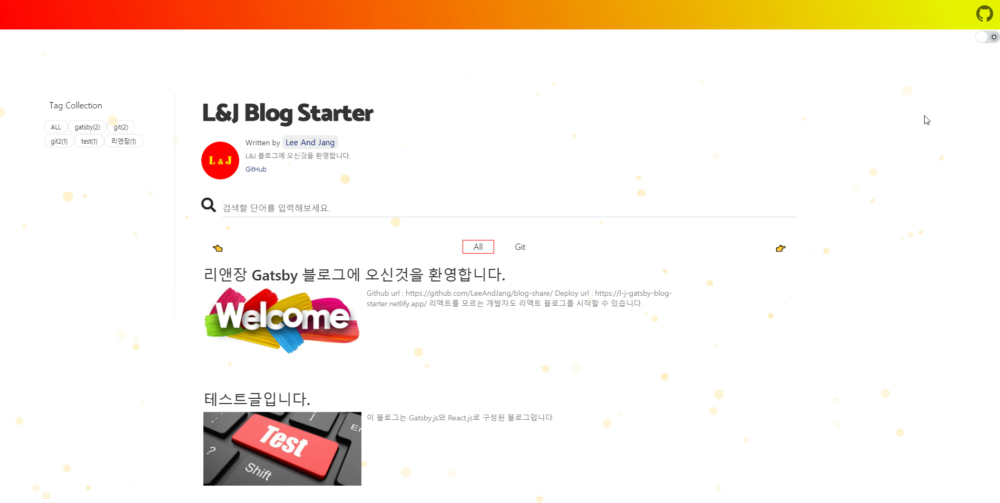
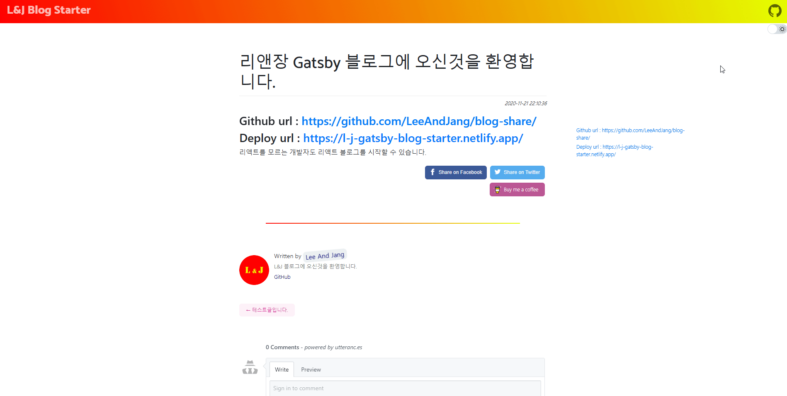
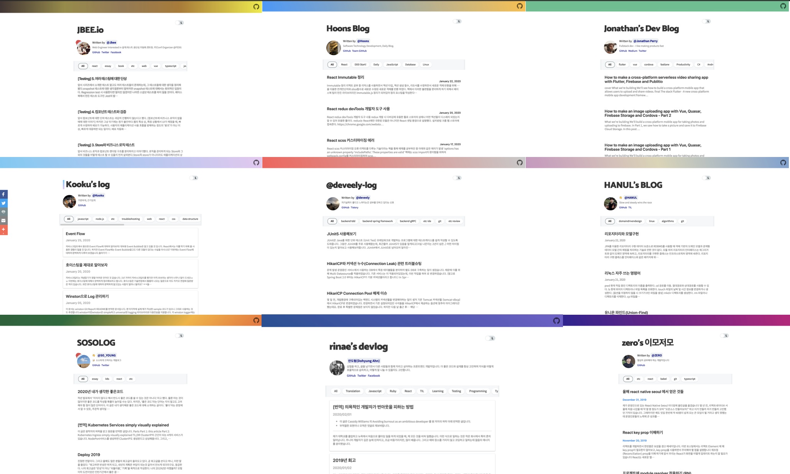

<!-- [한국어🇰🇷](./README.ko.md) -->

<div align="center">

  
  

</div>

<br><br>

[](https://github.com/LeeAndJang/blog-share/issues)
[](https://app.netlify.com/sites/LeeAndJang/deploys)

<br><br>

## LeeAndJang Gatsby blog starter 는...

- `React.js`와 `Gatsby.js`를 이용하여 누구나 손쉽게 블로그를 운영할 수 있습니다.
- `Netlify`와 `Github`를 통한 무중단, 자동배포, 서버리스 웹서비스를 제공합니다.
- 이 템플릿을 이용하면 리액트에 대한 지식이 없어도 `리액트 기반 블로그`를 체험할 수 있습니다.
- 별도의 운영서버없이 `무료 호스팅 서비스`를 이용하여 나만의 블로그를 `직접` 제작할 수 있습니다.

<br>

## LeeAndJang Gatsby blog starter 에서 제공하는 서비스는...

- 💄 Code highlight with Fira Code font
- 🧙 CLI Tool
- 😄 Emoji (emojione)
- 🗣 Social share feature (Twitter, Facebook)
- 💬 Comment feature (disqus, utterances)
- ☕ 'Buy me a coffee' service
- 🤖 GA(Google Analytics)
- ⭐ Enhance UX
- ⚙ Configurable

<br>

## 데모 사이트

- [Click Here !](https://l-j-gatsby-blog-starter.netlify.com/)

<details open>
  <summary>Use case (블로그를 사용해주시는 고마운 분들)</summary>
  <p>
    <!--  -->
    <ul>
      <li>L's tech blog: https://ramsbaby.netlify.com/</li>
      <li>J's tech blog: https://goguj.netlify.com/</li>
      <li>김선휘님의 blog: https://bisunny.netlify.com/</li>
    </
    </ul>
  </p>
</details>

> 이 블로그 템플릿을 사용하시는 경우, `Use case` 에 본인의 블로그를 추가해주시길 부탁드립니다!

<br><br>

## 🤟 Quick Start

### 1. Clone a project

```sh
# create a new Gatsby site using the blog starter
npx gatsby new my-blog-starter https://github.com/LeeAndJang/L-J-gatsby-blog-starter
```

> If you are not using `npx`, following [Gatsby Getting Started](https://github.com/LeeAndJang/L-J-gatsby-blog-starter)

```sh
npm install -g gatsby-cli
gatsby new my-blog-starter https://github.com/LeeAndJang/L-J-gatsby-blog-starter
```

### 2. Start developing

```sh
cd my-blog-starter/
npm run develop
# open localhost:8000
```

### 3. Add your content

You can write...

- contents to blog in `content/blog` directory.
- resume `content/__about` directory.

> With markdown syntax and some meta data

### 4. Fix meta data

You can fix meta data of blog in `/gatsby-meta-config.js` file.

### 5. Publish with [netlify](https://netlify.com)

[](https://app.netlify.com/start/deploy?repository=https://github.com/LeeAndJang/L-J-gatsby-blog-starter)

> if you want to deploy github pages, add following script to package.json

```json
"scripts": {
    "deploy": "gatsby build && gh-pages -d public -b master -r 'git@github.com:${your github id}/${github page name}.github.io.git'"
}
```

<br><br>

## 🧐 Customize

### ⚙ Gatsby config

```sh
/root
├── gatsby-browser.js // font, polyfill, onClientRender ...
├── gatsby-config.js // Gatsby config
├── gatsby-meta-config.js // Template meta config
└── gatsby-node.js // Gatsby Node config
```

### ⛑ Structure

```sh
src
├── components // Just component with styling
├── layout // home, post layout
├── pages // routing except post: /(home), /about
├── styles
│   ├── code.scss
│   ├── dark-theme.scss
│   ├── light-theme.scss
│   └── variables.scss
└── templates
    ├── blog-post.js
    └── home.js
```

### 🎨 Style

You can customize color in `src/styles` directory.

```sh
src/styles
├── code.scss
├── dark-theme.scss
├── light-theme.scss
└── variables.scss
```

### 🍭 Tips (You can change...)

- Profile image! (replace file in `/content/assets/profile.png`)
- Create thumbnail image (add file to `/static`)
- Favicon image! (replace file in `/content/assets/React.js_logo-512.png`)
- Header gradient! (\$theme-gradient `/styles/variables.scss`)
- Utterances repository! (replace repository address in `/gatsby-meta-config.js`)
  - ⚠️ Please check, this guide(https://utteranc.es/)

<br><br>

## ☕ Like it?

<a href="https://www.buymeacoffee.com/ramsbaby" target="_blank">
  
</a>

<br><br>

## 🙏 Source of Our blog...

[한재엽님의 블로그](https://github.com/JaeYeopHan/gatsby-starter-bee/)!

<br><br>

## :bug: Bug reporting

[Issue](https://github.com/LeeAndJang/L-J-gatsby-blog-starter/issues)

<br><br>

## 🎁 Contributing

[Contributing guide](./CONTRIBUTING.md)

<br><br>

## 👏 Creator

[이정우](https://www.notion.so/Ramsbaby-13eb750380004cab9942867038d7e00f)
<br>
[장철우](https://github.com/jcwooo)

<br><br>

## LICENSE

[MIT](./LICENSE)

<div align="center">

<sub><sup>Project by <a href="https://github.com/LeeAndJang/L-J-gatsby-blog-starter/">@LeeAndJang</a></sup></sub><small>✌</small>

</div>
