## Netlify를 이용한 블로그 배포

<br>

### 1. L-J-gatsby-blog-starter를 repository로 내려받기.

블로그를 배포하기 위해선 github repository에 블로그를 내려받아야 합니다.(L-J-gatsby-blog-starter clone 받으셨죠?)<br>
'git clone [github url]' 혹은 'gatsby new [name][github url]' 두가지 방법 중 하나를 선택하셔서 내려 받으시면 됩니다.

```sh
git clone https://github.com/LeeAndJang/L-J-gatsby-blog-starter
```

```sh
gatsby new my-blog https://github.com/LeeAndJang/L-J-gatsby-blog-starter
```

내 repository에 받아졌다면 github에서 아래와 같이 확인하실 수 있습니다.

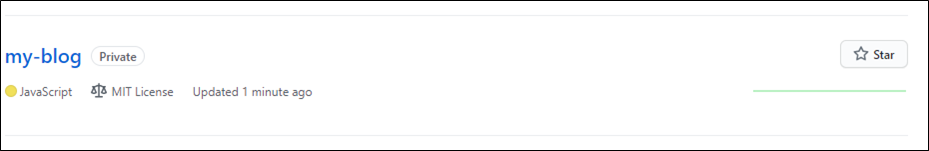
<br>
github에 블로그가 올라가 있다면 배포 준비가 70%는 끝났습니다. 어떻게 70%나 되냐구요?<br>
바로 Netlify 라는 호스팅 웹서비스를 이용하기 때문이에요.<br>

### 2. Netlify 가입하기.

https://www.netlify.com/ 로 이동해 보겠습니다.
2021년 01월 13일 기준으로 netlify 메인화면은 아래 그림과 같이 구성이 되어 있네요.

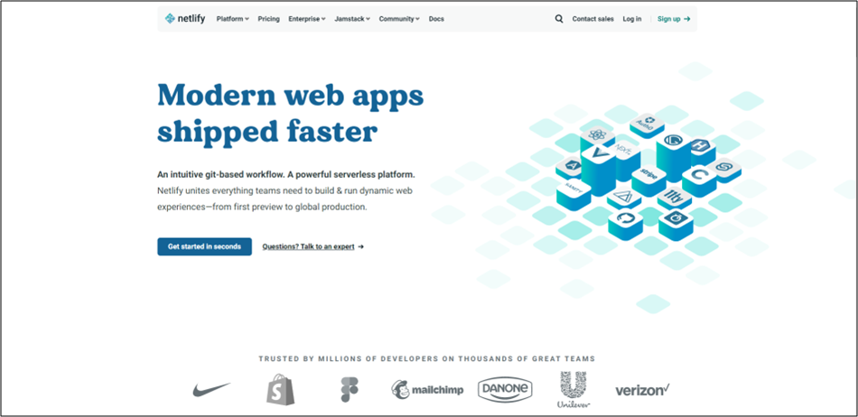
<br>
처음 이용하시는 분들은 'Sign up'을 클릭해주세요.

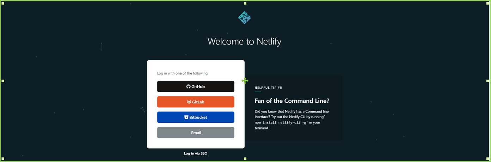
<br>

가입 방식에는 4가지의 방법이 있지만, 이 글에서는 GitHub으로 진행하겠습니다.<br>
Github으로 로그인을 하고 'New site from Git' 버튼을 클릭해주세요.<br>
'New site from Git' 버튼을 클릭하여 이동한 화면 하단의 Github을 클릭해주세요.<br>

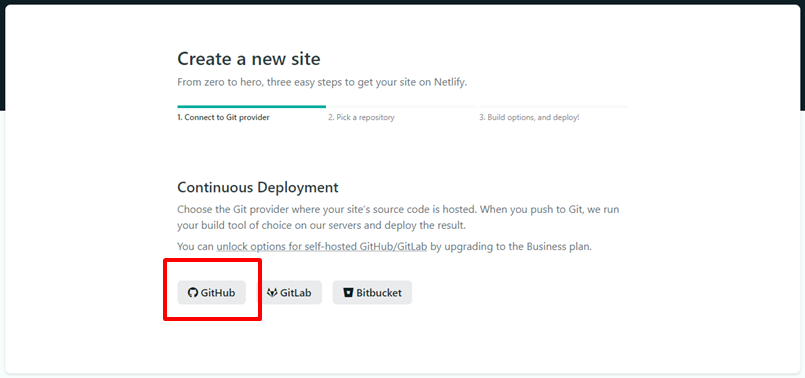
<br>

Github 버튼을 클릭하면 자신의 github repository 리스트를 불러오게 됩니다.<br>
배포할 github repository를 클릭해주세요. <br>

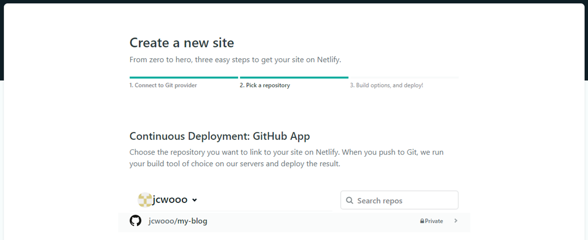
<br>

마지막으로 하단의 'Deploy site'를 클릭하면 배포가 시작됩니다.

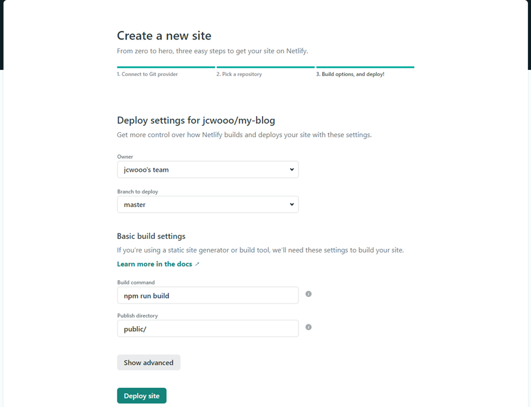
<br>

### 3. 배포 확인하기

배포가 시작되면 아래 그림처럼 'Starting Up' 라는 메세지를 확인하실 수 있습니다.

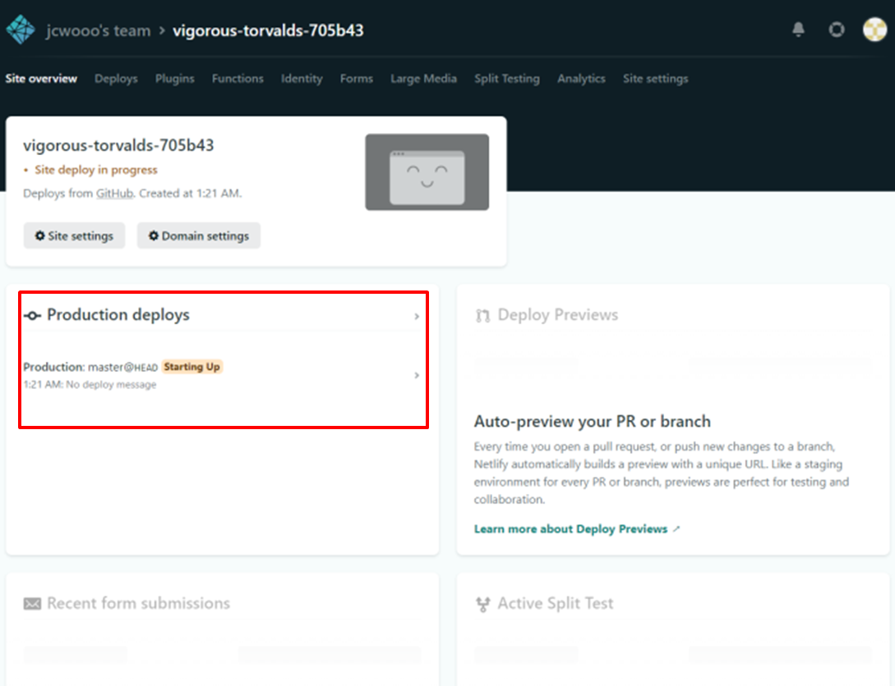

클릭해보면 로그를 확인하실 수 있습니다.

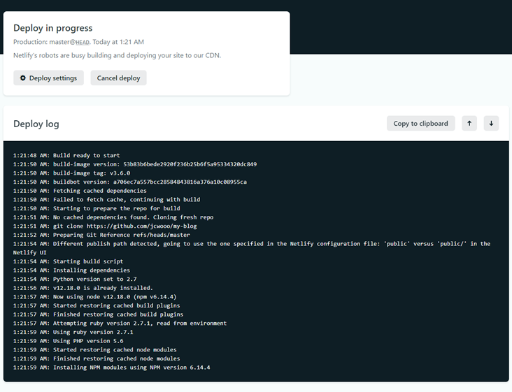
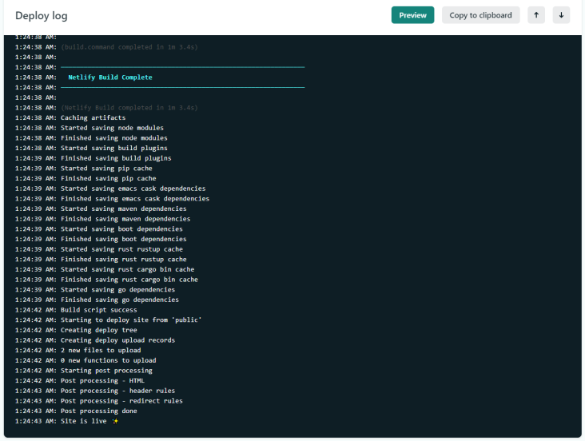

'Site is live' 라는 로그가 뜨게 되면 배포 성공!<br>
실제로 사이트가 배포 되었는지 확인해 볼까요?<br>
전 화면으로 다시 돌아가면 배포 된 URL 주소를 확인할 수 있습니다. <br>

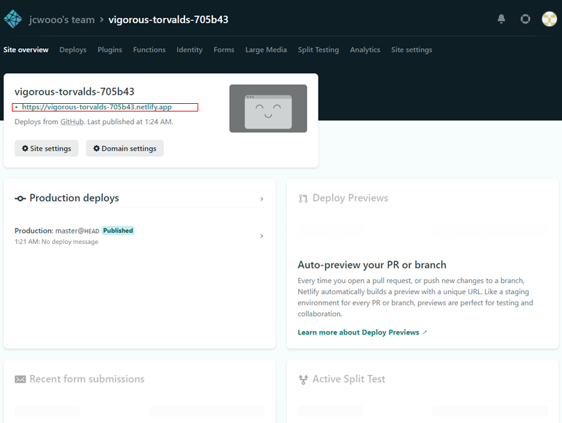

정말로 해당 URL로 배포 되었는지 확인해볼까요?

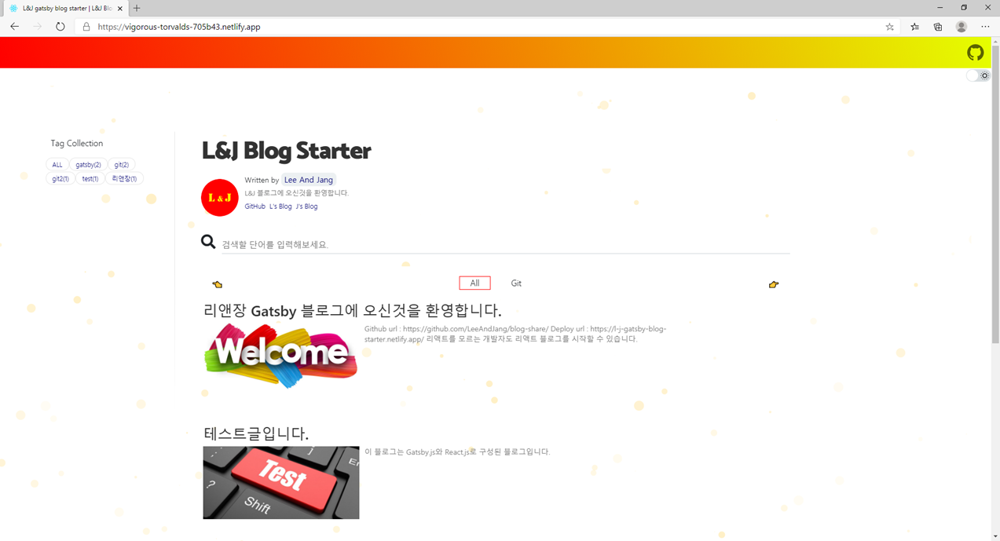

사이트가 배포 되었네요!

### 4. URL 변경하기

URL을 변경하고 싶다면 'Domain settings'를 클릭한 후 'Site settings' 버튼을 클릭해주세요.

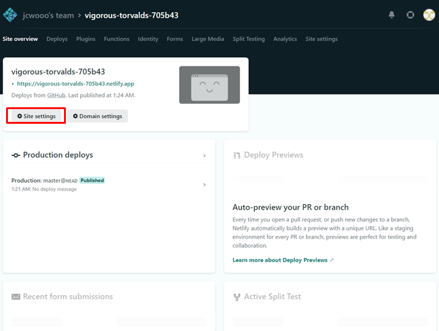

'Change site name'을 클릭하면 원하는 URL로 바꿀 수 있습니다.

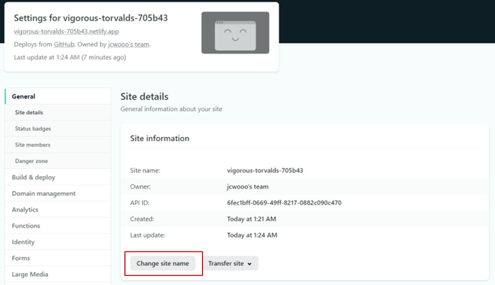
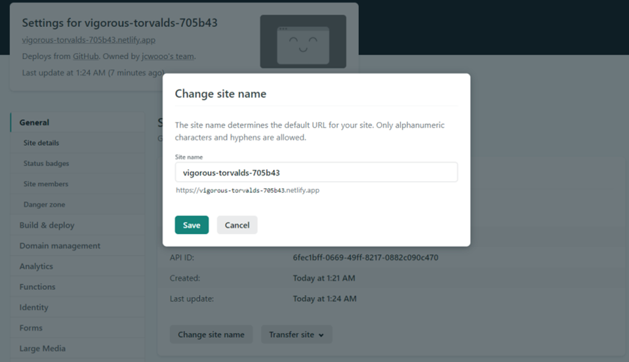

그럼 블로그 배포하기 설명을 마치겠습니다. <br>
즐거운 블로깅 하세요!
