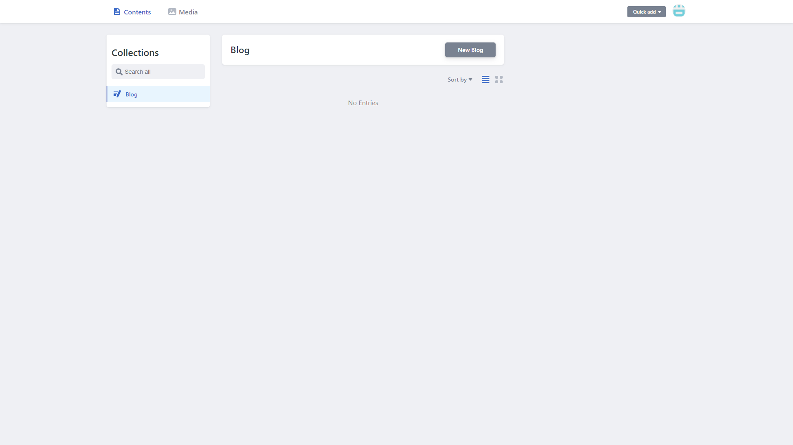
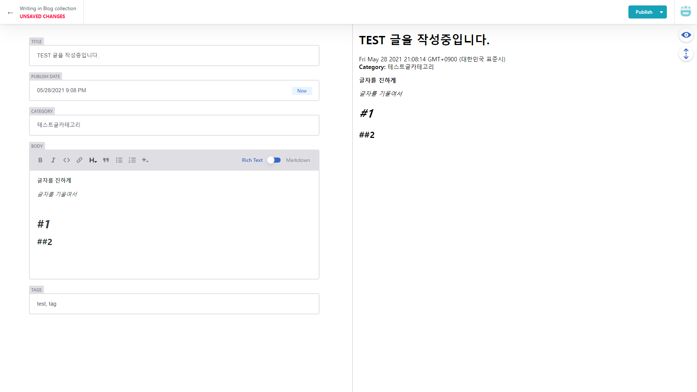
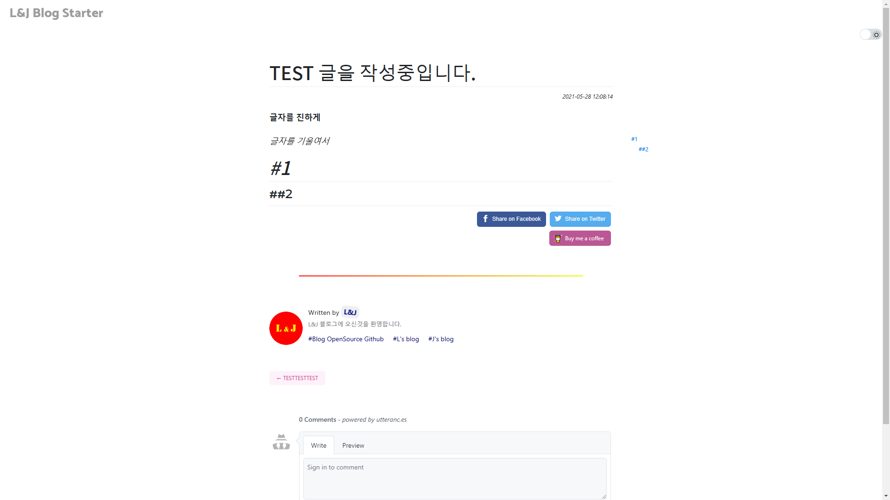

 
 
 
 

## 서론

기존의 블로그는 마크다운으로 작성된 글을 매번 빌드하고 배포해주어야 했습니다.  
역시 불편하기 짝이 없었습니다. 😫  
그래서 개발자가 아닌 분들도 사용할 수 있도록 웹에서 글을 작성할 수 있는 기능을 찾던 중,
Netlify에서 제공하는 `Netlify-CMS` 기능을 발견하였습니다.

 
 
 
 

## Netlify-CMS 란?

기존에 글을 배포하는 과정은 마크다운파일을 커밋하고, push 를 통해 깃으로 옮겨놓으면 연동된 netlify가 git에 있는 마크다운파일을 가져가는 형식이었는데요.

 

이러한 과정없이 웹에서 바로 글을 쓰거나, 이미지를 등록할 수 있도록 도와주는 도구입니다.

 
 
 
 

## 어떻게 사용하나요?

1. 본인 블로그 주소뒤에 /admin 이라는 백도어를 입력하면 바로 CMS 페이지로 이동할 수 있게 되어있습니다.

   > 예시 : https://{myid}.netlify.app/admin

   해당 페이지에 접속하면, 깃허브 로그인을 통해 아래와 같은 페이지로 이동하게 됩니다.

 
 
 
 

2. `New Blog` 버튼을 클릭하면 글작성 페이지로 이동할 수 있습니다.
   글을 작성 후, 우측 상단의 `Publish` 버튼을 클릭하여 바로 깃허브에 배포할 수 있습니다.

 
 
 
 

3. `Publish` 를 누른 후, 잠시 뒤 본인의 블로그에 CMS를 통해 작성한 글이 업로드 된 것을 확인할 수 있습니다.

 
 
 
 

즐거운 블로깅 되세요~!
